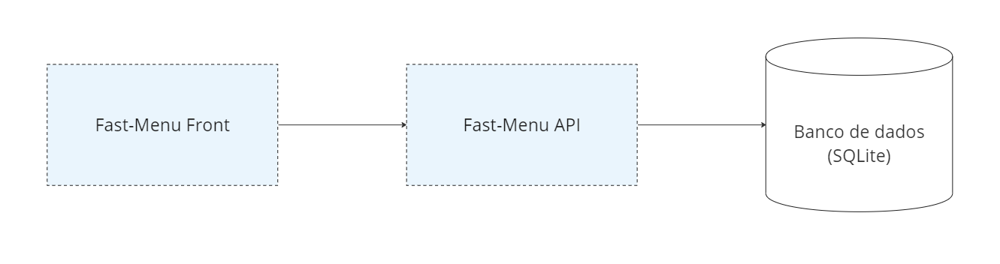

# Fast Menu API

## Sobre
Fast Menu API é uma API para gerenciar o cardápio de um restaurante.

## Lista de Endpoints
Segue a lista de endpoints disponíveis em Fast Menu API

### Restaurante Controller
#### Obter dados do restaurante
Este endpoint recebe o id do restaurante e retorna o cardápio completo.\
**Rota:** restaurante/home?id_restaurante=1\
**Método Http:** GET\
**Autenticação:** Não precisa de autenticação por enquanto\
**Autorização:** N/A\
**Observação:** Informe id_restaurante = 1, pois é o único restaurante cadastrado na base de dados e a Api ainda não possibilita a criação de novos restaurantes

### Cardápio Seção Controller
#### Criar nova seção
Este endpoint recebe no payload o nome da nova seção e o id do cardápio ao qual esta seção deverá pertencer\
**Rota:** cardapio-secao/novo\
**Método Http:** POST\
**Autenticação:** Não precisa de autenticação por enquanto\
**Autorização:** N/A

#### Atualizar nome da seção
Este endpoint recebe no payload o novo nome da seção e o id da seção\
**Rota:** cardapio-secao/atualizar-nome\
**Método Http:** PATCH\
**Autenticação:** Não precisa de autenticação por enquanto\
**Autorização:** N/A

#### Deletar seção
Este endpoint recebe no payload id da seção a ser deletada\
**Rota:** cardapio-secao/deletar\
**Método Http:** DELETE\
**Autenticação:** Não precisa de autenticação por enquanto\
**Autorização:** N/A

### Cardápio Item Controller
#### Criar novo item
Este endpoint recebe o id da seção que o item irá pertencer, o nome do item e o valor do item\
**Rota:** cardapio-item/novo\
**Método Http:** POST\
**Autenticação:** Não precisa de autenticação por enquanto\
**Autorização:** N/A

#### Atualizar nome de um item
Este endpoint recebe no payload id do item que está sendo atualizado e seu novo nome\
**Rota:** cardapio-item/atualizar-nome\
**Método Http:** PATCH\
**Autenticação:** Não precisa de autenticação por enquanto\
**Autorização:** N/A

#### Atualizar valor de um item
Este endpoint recebe no payload id do item que está sendo atualizado e seu novo valor\
**Rota:** cardapio-item/atualizar-valor\
**Método Http:** PATCH\
**Autenticação:** Não precisa de autenticação por enquanto\
**Autorização:** N/A

#### Deletar um item
Este endpoint recebe no payload id do item a ser deletado\
**Rota:** cardapio-item/deletar\
**Método Http:** DELETE\
**Autenticação:** Não precisa de autenticação por enquanto\
**Autorização:** N/A

## Descrição técnica
Fast-Menu Api é um monolito que se conecta a um banco de dados SQLite e que tem por objetivo fornecer os endpoints necessários para o front-end funcionar.
Segue abaixo a topologia da aplicação.

### Implementação
- Fast-Menu Api foi implementada utilizando a linguagem python e o framework Flask.
- O arquivo raiz da aplicação chama-se *app.py*
- As entidades da aplicação encontram-se no diretório *modelos*
- Os controllers encontram-se no diretório *controllers*
- O diretório *schemas* contém as classes para transferência de dados (DTOs) que são utilizadas como contratos para cada endpoint da API
- O diretório *bootstraper* contém o arquivo *inicializar_db* que por sua vez contém o método *inicializar*. Este método contém a carga inicial de dados.

## Requisitos e Como executar
### Requisitos
1. git instalado
2. python instalado
3. [Opcional] Algum gerenciador de pacotes python como virtualenv para facilitar a criação de um ambiente virtual ([virtualenv](https://virtualenv.pypa.io/en/latest/installation.html))

### Como executar
1. git clone https://github.com/matheusmughrabi/fast-menu-api.git
2. Abra o terminal no diretório relativo a raiz do projeto: .\src\FastMenu.Api
3. [Opcional] Crie o ambiente virtual
4. [Opcional] Ative o ambiente virtual
5. Execute o comando pip install -r requirements.txt
6. Execute o comando flask run --host 0.0.0.0 --port 5000 IMPORTANTE EXECUTAR COM A PORTA 5000 POIS O PROJETO FAST MENU FRONT ESTÁ APONTANDO PARA ESTA PORTA

## Próximas features
Segue a lista de próximas features que serão implementadas em Fast Menu API
1. Autenticação e Autorização em cada endpoint da aplicação
2. Rota para criação de contas
3. Rota para criação de usuários
4. Módulo de pedidos com as rotas a seguir
    1. Adicionar item ao carrinho
    2. Remover item do carrinho
    3. Enviar itens do carrinho para a cozinha
    4. Fechar conta
5. Módulo de pagamentos no qual os pagamentos são registrados
6. Módulo de sugestões do cliente no qual o cliente pode registrar suas sugestões para o restaurante

## Limitações
O projeto Fast Menu API é apenas um MVP, por isso o conjunto de features implementadas é bastante limitado.
Segue algumas limitações atuais do projeto:
1. Não é possível criar outras contas, temos apenas a conta de Id = 1 cadastrada na base e essa conta possui o restaurante de Id = 1 cadastrado na base. No futuro a aplicação será multi-tenant.
2. A API não necessita de autenticação atualmente, ao executar o projeto podemos fazer requests para qualquer endpoint
3. Não é possível criar novos restaurantes para a conta. No futuro penso que uma conta pode ter vários restaurantes para atender clientes grandes.

### Observações
1. Utilizei o banco de dados sqlite, então não é necessário ter nenhuma infraestrutura adicional instalada

